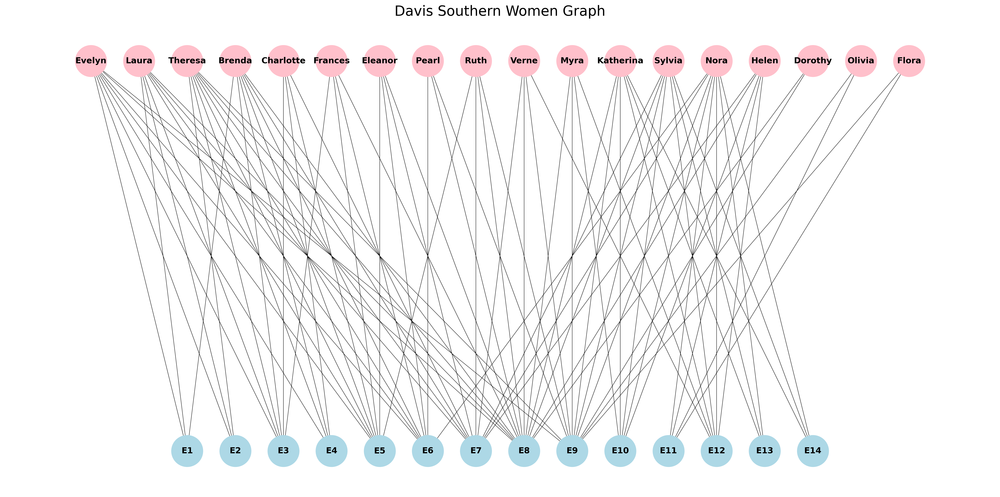
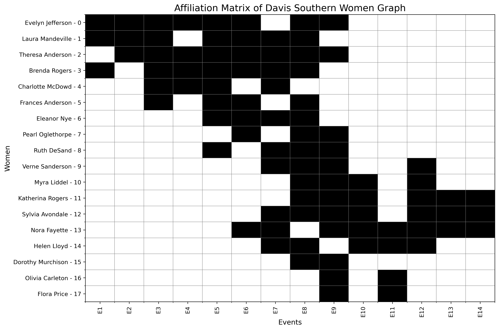
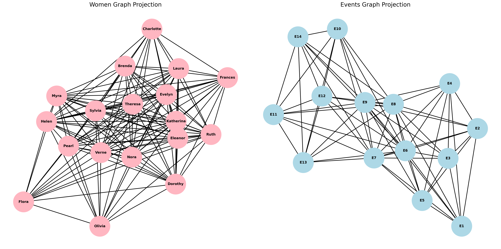
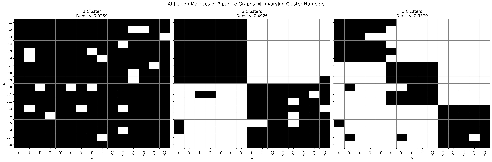
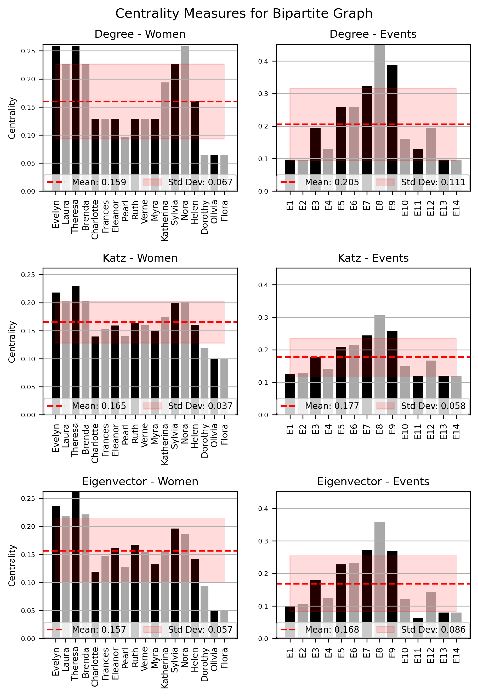

# Southern Women Dataset Analysis

This project demonstrates the application of network science concepts to the classic Southern Women dataset, illustrating various analytical techniques and their interpretations.

## Dataset Overview

The Southern Women dataset, collected by Davis et al. [1] in the 1930s, records the attendance of 18 women at 14 informal social events in Natchez, Mississippi. This dataset serves as an excellent example for studying bipartite networks and social structures.

*Figure 1: Bipartite graph representation of the Southern Women dataset. Open circles represent women, shaded circles represent events.*

## Incidence Matrix

The incidence matrix is a fundamental representation of bipartite networks. For our dataset with $l = |V|$ events and $n = |U|$ women, the incidence matrix $\mathbf{B} \in \mathbb{N}_{+}^{l \times n}$ is defined as:

$$
\mathbf{B}_{ij} = \begin{cases}
1 & \text{if woman } j \text{ attended event } i, \\
0 & \text{otherwise.}
\end{cases}
$$

*Figure 2: Affiliation matrix of the Southern Women dataset.*

The incidence matrix B exhibits a notable block structure, which can be represented as:

$$
\mathbf{B} = \begin{bmatrix}
    \mathbf{A}_1& \mathbf{0} \\
    \mathbf{0} & \mathbf{A}_2
\end{bmatrix}
$$

where $\mathbf{A}_i$ are non-zero submatrices, and $\mathbf{0}$ represents (near) zero submatrices.

## One-Mode Projections

One-mode projections allow us to analyze relationships within a single set of nodes. For the women's projection:

$$
\mathbf{R} = \mathbf{B}^T \mathbf{B}
$$

Where $\mathbf{R}_{ij}$ represents the number of events both women $i$ and $j$ attended.

*Figure 3: One-mode projections of the Southern Women network.*

For the events projection:

$$
\mathbf{R}' = \mathbf{B}\mathbf{B}^T
$$

## Density

The density $\rho$ of a bipartite graph is calculated as:

$$
\rho_b = \frac{|E|}{|U| \times |V|}
$$

For our dataset, $\rho_b = 0.3532$.

*Figure 4: Affiliation matrices with varying cluster numbers, demonstrating the effect on density.*

For a bipartite graph with $k$ clusters, we can approximate the upper bound on density as:

$$
\rho_b \approx \frac{1}{k}
$$

## Centrality Measures

We explore several centrality measures:

1. **Degree Centrality**: $C_D(v) = \frac{deg(v)}{n - 1}$
2. **Eigenvector Centrality**: $\mathbf{Ax} = \lambda\mathbf{x}$
3. **Katz Centrality**: $\mathbf{x} = \alpha(\mathbf{I} - \beta\mathbf{A})^{-1}\mathbf{1}$

*Figure 5: Centrality measures for the Southern Women dataset.*

## Clustering Results

| Algorithm | Category | Time Complexity | Requires k |
|-----------|----------|-----------------|------------|
| Louvain [2] | Graph-based | O(N · log N) | No |
| Girvan-Newman (GN) [3] | Edge betweenness | O(|V| · |E|^2) | No |
| Label Propagation (LP) [4] | Graph-based | O(·|E|) | No |
| Leading Eigenvector (LE) [5] | Graph-based | O((|V| + |U|)^2 + |E|) | No |
| Spectral Clustering (SC) [6] | Graph-based | O(k · |V|^2) | Yes |
| K-means (KM) [7] | Traditional | O(k · |U| · |V|) | Yes |
| K-medoids (KM+) [8] | Traditional | O(k · |U|^2 · |V|) | Yes |
| BGC [9] | Specialized | O((|E| + |U| · k) · β) | Yes |
| FNEM [9] | Specialized | O(|E| · β + |U| · β^2 + |U| · k^2) | Yes |
| SNEM [9] | Specialized | O(|E| · β + |U| · β^2 + |U| · k) | Yes |

Table 2: Overview of Clustering Algorithms for Bipartite Graphs. Note, β is the dimensionality of low-rank approximation [?], and N = |U ∪ V|.

### Comparison of Clustering Methods

Table 1 compares different methods for finding the number of clusters in the Southern Women dataset.

| Network | Nodes | Links | Non-backtracking | Louvain | Newman | Modularity eigengap | Density Est |
|---------|-------|-------|-------------------|---------|---------|---------------------|-------------|
| Davis Southern Women | 32 | 89 | 2 | 4 | 2 | 31 | 2.830000 |
| Davis Southern Women (Row Projection) | 18 | 139 | 1 | 2 | 2 | 1 | 1.100000 |

### Comparison of Clustering Algorithms

### Clustering Results for k=2

Table 2 shows the clustering results for k=2 clusters, comparing the true grouping with various algorithms.

| Name | True | Louvain | GN | LP | KM | KM+ | BGC | FNEM | SNEM | LE | SC |
|------|------|---------|----|----|----|----|-----|------|------|----|----|
| Evelyn Jefferson | 0 | 1 | 0 | 0 | 1 | 0 | 1 | 0 | 0 | 0 | 1 |
| Laura Mandeville | 0 | 1 | 0 | 0 | 1 | 1 | 1 | 0 | 0 | 0 | 1 |
| Theresa Anderson | 0 | 1 | 0 | 0 | 1 | 0 | 1 | 0 | 0 | 0 | 1 |
| Brenda Rogers | 0 | 1 | 0 | 0 | 1 | 1 | 1 | 0 | 0 | 0 | 1 |
| Charlotte McDowd | 0 | 1 | 0 | 0 | 1 | 1 | 1 | 0 | 0 | 0 | 1 |
| Frances Anderson | 0 | 1 | 0 | 0 | 1 | 0 | 1 | 0 | 0 | 0 | 1 |
| Eleanor Nye | 0 | 2 | 0 | 0 | 1 | 0 | 1 | 0 | 0 | 0 | 1 |
| Pearl Oglethorpe | 0 | 2 | 0 | 0 | 1 | 0 | 1 | 0 | 0 | 0 | 1 |
| Ruth DeSand | 0 | 2 | 0 | 0 | 1 | 0 | 1 | 0 | 0 | 0 | 1 |
| Verne Sanderson | 1 | 2 | 0 | 0 | 0 | 0 | 1 | 0 | 0 | 0 | 0 |
| Myra Liddel | 1 | 0 | 1 | 0 | 0 | 0 | 1 | 0 | 0 | 0 | 0 |
| Katherina Rogers | 1 | 0 | 1 | 0 | 0 | 0 | 1 | 0 | 0 | 0 | 0 |
| Sylvia Avondale | 1 | 0 | 1 | 0 | 0 | 1 | 1 | 0 | 0 | 0 | 0 |
| Nora Fayette | 1 | 0 | 1 | 0 | 0 | 1 | 1 | 0 | 0 | 0 | 0 |
| Helen Lloyd | 1 | 0 | 1 | 0 | 0 | 0 | 1 | 0 | 0 | 0 | 0 |
| Dorothy Murchison | 1 | 2 | 2 | 0 | 0 | 0 | 1 | 0 | 0 | 0 | 0 |
| Olivia Carleton | 1 | 0 | 1 | 1 | 0 | 0 | 1 | 0 | 0 | 0 | 0 |
| Flora Price | 1 | 0 | 1 | 1 | 0 | 0 | 1 | 0 | 0 | 0 | 0 |

### Clustering Results for k=3

Table 3 shows the clustering results for k=3 clusters, comparing the true grouping with various algorithms.

| Name | True | Louvain | GN | LP | KM | KM+ | BGC | FNEM | SNEM | LE | SC |
|------|------|---------|----|----|----|----|-----|------|------|----|----|
| Evelyn Jefferson | 0 | 2 | 0 | 0 | 2 | 2 | 2 | 1 | 2 | 0 | 0 |
| Laura Mandeville | 0 | 2 | 0 | 0 | 2 | 2 | 2 | 1 | 2 | 0 | 0 |
| Theresa Anderson | 0 | 2 | 0 | 0 | 2 | 2 | 2 | 1 | 2 | 0 | 0 |
| Brenda Rogers | 0 | 2 | 0 | 0 | 2 | 2 | 2 | 1 | 2 | 0 | 0 |
| Charlotte McDowd | 0 | 2 | 0 | 0 | 2 | 2 | 2 | 1 | 2 | 0 | 0 |
| Frances Anderson | 0 | 2 | 0 | 0 | 2 | 2 | 2 | 1 | 2 | 0 | 0 |
| Eleanor Nye | 0 | 0 | 0 | 0 | 2 | 2 | 2 | 1 | 2 | 0 | 0 |
| Pearl Oglethorpe | 0 | 1 | 0 | 0 | 2 | 0 | 1 | 1 | 2 | 0 | 0 |
| Ruth DeSand | 0 | 0 | 0 | 0 | 1 | 0 | 2 | 1 | 2 | 1 | 0 |
| Verne Sanderson | 1 | 3 | 1 | 0 | 0 | 1 | 1 | 1 | 2 | 1 | 1 |
| Myra Liddel | 1 | 3 | 2 | 0 | 0 | 0 | 1 | 1 | 2 | 1 | 1 |
| Katherina Rogers | 1 | 3 | 2 | 0 | 0 | 1 | 1 | 1 | 2 | 1 | 1 |
| Sylvia Avondale | 1 | 3 | 2 | 0 | 0 | 1 | 1 | 1 | 2 | 1 | 1 |
| Nora Fayette | 1 | 3 | 2 | 0 | 0 | 1 | 1 | 1 | 2 | 1 | 1 |
| Helen Lloyd | 1 | 3 | 2 | 0 | 0 | 1 | 1 | 1 | 2 | 1 | 1 |
| Dorothy Murchison | 1 | 1 | 3 | 0 | 0 | 2 | 1 | 1 | 2 | 1 | 2 |
| Olivia Carleton | 1 | 1 | 2 | 1 | 0 | 0 | 1 | 1 | 2 | 1 | 2 |
| Flora Price | 1 | 1 | 2 | 1 | 0 | 0 | 1 | 1 | 2 | 1 | 2 |

These tables provide a comprehensive view of the clustering results and algorithm comparisons for the Southern Women dataset.

## Results and Evaluation

We evaluate clustering results using metrics such as Accuracy (Acc), F1 score (F1), Normalized Mutual Information (NMI), and Adjusted Rand Index (ARI).

| Algorithm | Acc (k=2/3) | F1 (k=2/3) | NMI (k=2/3) | ARI (k=2/3) | Time ms (k=2/3) |
|-----------|-------------|------------|-------------|-------------|-----------------|
| Louvain | 0.67 / 0.67 | 0.80 / 0.80 | 0.57 / 0.57 | 0.45 / 0.45 | 11.20 / 2.55 |
| Girvan Newman | 0.89 / 0.89 | 0.91 / 0.94 | 0.66 / 0.80 | 0.68 / 0.80 | 91.58 / 62.69 |
| Label Propagation | 0.61 / 0.61 | 0.54 / 0.54 | 0.16 / 0.16 | 0.03 / 0.03 | 1.43 / 1.33 |
| K-means | 1.00 / 0.67 | 1.00 / 0.79 | 1.00 / 0.54 | 1.00 / 0.44 | 3,344.13 / 1,059.05 |
| K-medoids | 0.78 / 0.67 | 0.77 / 0.73 | 0.39 / 0.44 | 0.27 / 0.28 | 1,007.48 / 979.38 |
| BGC | 0.50 / 0.94 | 0.33 / 0.94 | 0.00 / 0.74 | 0.00 / 0.78 | 6.76 / 7.02 |
| FNEM | 0.50 / 0.50 | 0.33 / 0.33 | 0.00 / 0.00 | 0.00 / 0.00 | 52.33 / 50.29 |
| SNEM | 0.50 / 0.50 | 0.33 / 0.33 | 0.00 / 0.00 | 0.00 / 0.00 | 39.69 / 42.68 |
| LE | 0.50 / 0.83 | 0.33 / 0.83 | 0.00 / 0.48 | 0.00 / 0.41 | 10.41 / 13.97 |
| SC | 1.00 / 0.83 | 1.00 / 0.90 | 1.00 / 0.81 | 1.00 / 0.76 | 4.46 / 3.91 |

## Conclusion

This analysis demonstrates the application of various network science techniques to the Southern Women dataset, showcasing the power of these methods in uncovering social structures and relationships within bipartite networks. The comparative study of different clustering algorithms reveals their strengths and limitations in analyzing this classic dataset.

## References

[1] Davis, A., Gardner, B. B., & Gardner, M. R. (1941). Deep South: A Social Anthropological Study of Caste and Class. University of Chicago Press.

[2] Blondel, V. D., Guillaume, J. L., Lambiotte, R., & Lefebvre, E. (2008). Fast unfolding of communities in large networks. Journal of statistical mechanics: theory and experiment, 2008(10), P10008.

[3] Girvan, M., & Newman, M. E. (2002). Community structure in social and biological networks. Proceedings of the national academy of sciences, 99(12), 7821-7826.

[4] Raghavan, U. N., Albert, R., & Kumara, S. (2007). Near linear time algorithm to detect community structures in large-scale networks. Physical review E, 76(3), 036106.

[5] Newman, M. E. (2006). Finding community structure in networks using the eigenvectors of matrices. Physical review E, 74(3), 036104.

[6] Von Luxburg, U. (2007). A tutorial on spectral clustering. Statistics and computing, 17(4), 395-416.

[7] MacQueen, J. (1967). Some methods for classification and analysis of multivariate observations. In Proceedings of the fifth Berkeley symposium on mathematical statistics and probability (Vol. 1, No. 14, pp. 281-297).

[8] Kaufman, L., & Rousseeuw, P. J. (2009). Finding groups in data: an introduction to cluster analysis (Vol. 344). John Wiley & Sons.

[9] Yang, R., & Shi, J. (2024). Efficient high-quality clustering for large bipartite graphs. Proceedings of the ACM on Management of Data, 2(1), 1-27.
